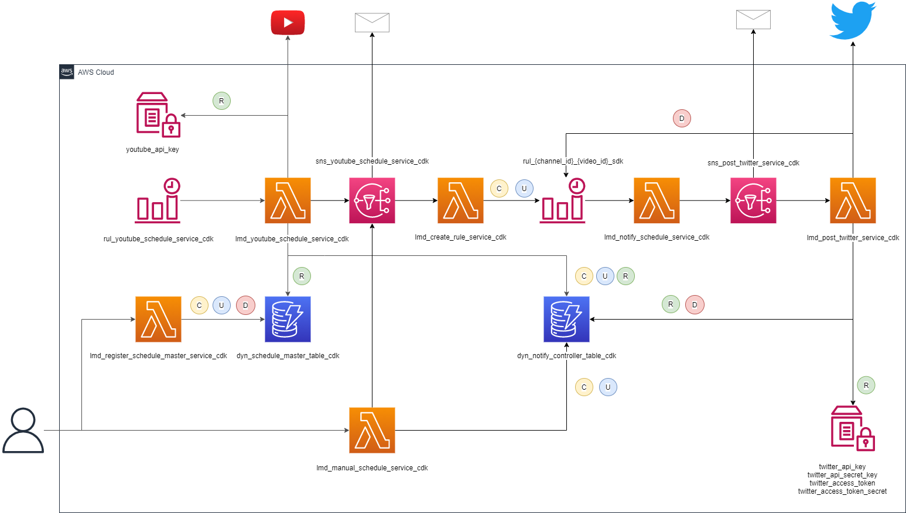

# NotifyDeliveryScheduleApp

YouTube配信30分前及び配信時刻に通知するシステム

## Quick Start

1. 初期構築

    1. 必要なライブラリをインストール
    ```sh
    $ sh deploy.sh
    ```
    2. CDK デプロイ
    ``` sh
    $ cdk deploy
    ```
2. パラメータストアに各種キーを格納
3. DynamoDBに対象のChannelIDを格納
4. 必要に応じてSNSサブスクリプションを設定


## Documentation

### アーキテクチャー図
